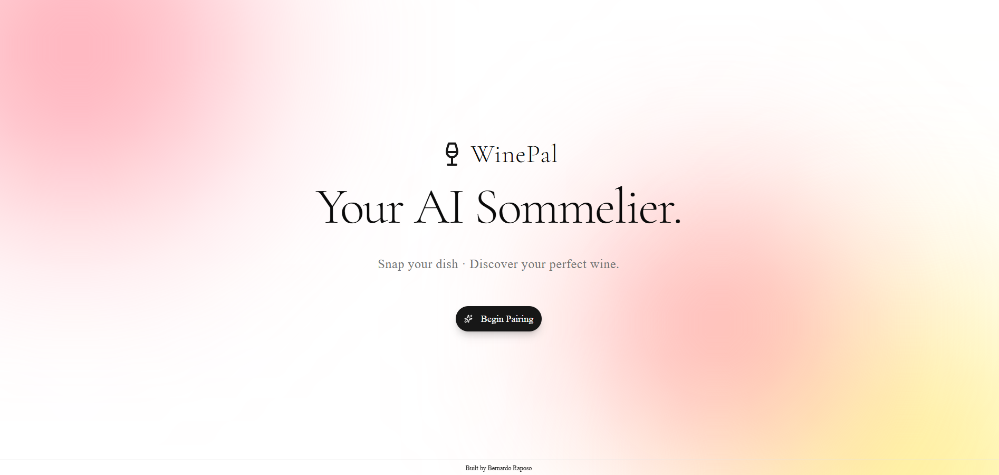

# WinePal

An AI-powered sommelier that helps you discover the perfect wine pairing for any dish.  
WinePal turns wine selection into a simple, fun, and beautifully designed experience.

## 🚀 Features
- 🍷 AI-driven wine recommendations  
- 🍽 Pair dishes to ideal wine styles  
- 📱 Mobile-friendly interface  
- ⚡ Fast, clean UI  
- 🎨 Tailored for everyday wine lovers

## 🧠 Why I Built This
I was going on a date and found out she liked red wine.
And I wanted to make sure I knew the right wine to ask for.  
WinePal helps people — experts or beginners — make confident choices instantly.

## 🛠 Tech Stack
- Next.js  
- Tailwind CSS  
- OPEN AI API 
- Vercel Deployment

## 📸 Screenshots

## 🧪 Future Improvements
- Create users structure
- Personalized taste profiles
- Sharing on social media button
- Save favorite pairings

## 🔗 Live Demo
https://usewinepal.shop/
